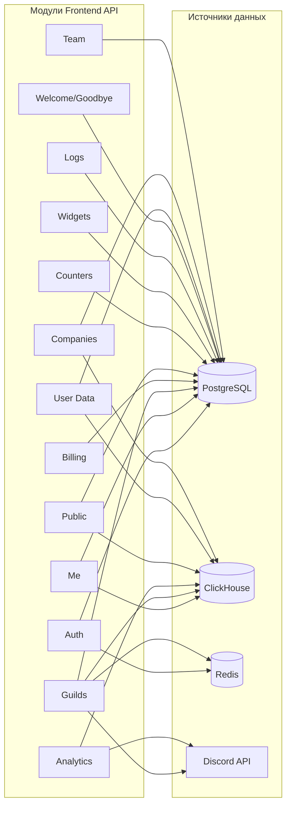

# Параметры и источники данных Frontend API

Справочник: что означает каждый параметр в ответах (и ключевых запросах) Frontend API и откуда берутся данные.

**Real-time:** часть параметров состояния гильдий (импорт, счётчики, участники, голос, ветки обсуждений и др.) может приходить в реальном времени через WebSocket. Подключение, подписка на гильдии и формат событий описаны в [15-realtime-guild-state.md](15-realtime-guild-state.md).

---

## Схема: модули и источники данных

---

## Легенда источников

| Обозначение | Описание |
|-------------|----------|
| **PostgreSQL** | Таблицы: `users`, `guilds`, `server_settings`, `guild_modules`, `usage_limits`, `plan_limits`, `subscription_plans`, `invoices`, `counters`, `widgets`, `guild_log_settings`, `guild_welcome_goodbye_setting`, `company_members`, `companies`, `company_invites`, `refresh_tokens` и др. |
| **ClickHouse** | Материализованные представления и таблицы: `mv_daily_activity`, `mv_top_members`, `mv_top_channels_messages`, `mv_top_channels_voice`, `mv_role_stats`, `raw_events`. Указывается период: всё время / последние 30 дней / период from–to. |
| **Redis** | Кэш списка гильдий пользователя (TTL 5 мин), сессии/токены. |
| **Discord API** | Данные на момент запроса: `GET /users/@me/guilds`, `GET /guilds/:id/channels`, роли гильдии. |
| **Вычисляемое** | Агрегат или формула в коде (например, summary из timeSeries). |

---

## 1. Auth

Ответы эндпоинтов: `POST /auth/register`, `POST /auth/login`, `POST /auth/discord/verify`, `GET /auth/discord/callback`, `POST /auth/refresh`.

### Ответ: token / user (register, login, discord/verify, discord/callback)

| Параметр | Тип | Источник данных | Период/область | Описание |
|----------|-----|----------------|----------------|----------|
| token / accessToken | string | Вычисляемое (AuthService, JWT) | — | JWT для заголовка Authorization; сессия хранится в Redis. |
| user.id | string (UUID) | PostgreSQL `users.id` | — | Внутренний идентификатор пользователя. |
| user.name | string | PostgreSQL `users.username` | — | Отображаемое имя. |
| user.email | string \| null | PostgreSQL `users.email` | — | Email пользователя. |
| user.avatar | string \| null | PostgreSQL `users.avatar_url` | — | URL аватара. |

### Ответ: refresh

| Параметр | Тип | Источник данных | Период/область | Описание |
|----------|-----|----------------|----------------|----------|
| accessToken | string | Вычисляемое (AuthService, JWT) | — | Новый JWT; refresh token обновляется в cookie. |

---

## 2. Me

### GET /api/me

| Параметр | Тип | Источник данных | Период/область | Описание |
|----------|-----|----------------|----------------|----------|
| data.id | string (UUID) | PostgreSQL `users.id` | — | Идентификатор пользователя. |
| data.name | string | PostgreSQL `users.username` | — | Имя пользователя. |
| data.email | string \| null | PostgreSQL `users.email` | — | Email. |
| data.avatar | string \| null | PostgreSQL `users.avatar_url` | — | URL аватара. |

### GET /api/me/guilds

См. раздел **3. Guild list**.

### GET /api/me/team

| Параметр | Тип | Источник данных | Период/область | Описание |
|----------|-----|----------------|----------------|----------|
| data[].id | string | PostgreSQL `company_members.id` | — | Идентификатор записи участника. |
| data[].name | string | PostgreSQL `users.username` | — | Имя участника. |
| data[].email | string \| null | PostgreSQL `users.email` | — | Email участника. |
| data[].avatar | string \| null | PostgreSQL `users.avatar_url` | — | Аватар участника. |
| data[].role | string | PostgreSQL `company_members.role` | — | Роль в команде (Owner, Admin, Member). |
| data[].joinedAt | string (ISO 8601) | PostgreSQL `company_members.joined_at` | — | Дата присоединения. |
| meta | object | Вычисляемое | — | total, page, limit, totalPages. |

### GET /api/me/usage

| Параметр | Тип | Источник данных | Период/область | Описание |
|----------|-----|----------------|----------------|----------|
| data.servers.used | number | PostgreSQL `usage_limits.servers_used` | — | Использовано серверов. |
| data.servers.limit | number | PostgreSQL `plan_limits.servers_limit` (по user.plan) | — | Лимит по тарифу. |
| data.servers.isOverLimit | boolean | Вычисляемое | — | used >= limit (если limit > 0). |
| data.members.used | number | PostgreSQL `usage_limits.members_used` | — | Использовано участников. |
| data.members.limit | number | PostgreSQL `plan_limits.members_limit` | — | Лимит по тарифу. |
| data.members.isOverLimit | boolean | Вычисляемое | — | used >= limit (если limit > 0). |
| data.messages.used | number | PostgreSQL `usage_limits.messages_used` | — | Использовано сообщений. **В коде значение не обновляется** — может быть 0 или устаревшим. |
| data.messages.limit | number | PostgreSQL `plan_limits.messages_limit` | — | Лимит по тарифу. |
| data.messages.isOverLimit | boolean | Вычисляемое | — | used >= limit (если limit > 0). |

### GET /api/me/subscription

| Параметр | Тип | Источник данных | Период/область | Описание |
|----------|-----|----------------|----------------|----------|
| data.id | string | PostgreSQL `subscription_plans.id` (по user.plan) | — | Идентификатор плана. |
| data.name | string | PostgreSQL `subscription_plans.name` | — | Название плана. |
| data.price | number | PostgreSQL `subscription_plans.price` | — | Цена. |
| data.pricePeriod | string | PostgreSQL `subscription_plans.price_period` | — | month \| year. |

### GET /api/me/invoices

| Параметр | Тип | Источник данных | Период/область | Описание |
|----------|-----|----------------|----------------|----------|
| data[].id | string | PostgreSQL `invoices.id` | — | Идентификатор счёта. |
| data[].amount | number | PostgreSQL `invoices.amount` | — | Сумма. |
| data[].currency | string | PostgreSQL `invoices.currency` | — | Валюта. |
| data[].date | string (ISO 8601) | PostgreSQL `invoices.date` | — | Дата счёта. |
| data[].status | string | PostgreSQL `invoices.status` | — | paid \| pending \| failed. |
| data[].downloadUrl | string \| null | PostgreSQL `invoices.download_url` | — | Ссылка на PDF (если есть). |
| meta | object | Вычисляемое | — | total, page, limit, totalPages. |

### PATCH /api/me

Ответ совпадает с GET /api/me; источник — PostgreSQL `users` после сохранения.

---

## 3. Guild list (GET /api/me/guilds, GET /api/companies/:companyId/guilds)

| Параметр | Тип | Источник данных | Период/область | Описание |
|----------|-----|----------------|----------------|----------|
| data[].id | string (Snowflake) | PostgreSQL `guilds.discord_guild_id` | — | Discord ID гильдии. |
| data[].name | string | PostgreSQL `guilds.name` | — | Название сервера. |
| data[].icon | string | PostgreSQL `guilds.icon_url` | — | URL иконки (или пустая строка). |
| data[].status | string | PostgreSQL `guilds.status` | — | active \| inactive \| error. |
| data[].memberCount | number | PostgreSQL `guilds.member_count` | — | Количество участников (обновляется ботом/воркерами). |
| data[].messageCount | number | ClickHouse `mv_daily_activity` (getTotalMessagesByGuildIds) | **Всё время** | Сумма сообщений по гильдии за всё время. |
| data[].lastActivity | string \| null (ISO 8601) | PostgreSQL `guilds.last_activity` | — | Последняя активность. |
| data[].ownerId | string (UUID) | PostgreSQL `guilds.owner_id` | — | Владелец (внутренний UUID). |
| data[].subscriptionTier | string | PostgreSQL `guilds.subscription_tier` | — | free \| pro \| enterprise. |
| data[].onlineMembers | number | PostgreSQL `guilds.online_members` | — | Онлайн-участники (обновляется ботом). |
| data[].memberGrowth | number | PostgreSQL `guilds.member_growth` | — | Рост участников. |
| data[].banner | string | PostgreSQL `guilds.banner` | — | URL баннера (или пустая строка). |
| meta | object | Вычисляемое | — | total, page, limit, totalPages. |

---

## 4. Guilds

### GET /api/guilds (список гильдий пользователя по Discord OAuth)

| Параметр | Тип | Источник данных | Период/область | Описание |
|----------|-----|----------------|----------------|----------|
| data[].id | string (Snowflake) | Discord API `GET /users/@me/guilds` (кэш Redis 5 мин) | На момент запроса | Discord ID гильдии. |
| data[].name | string | Discord API | На момент запроса | Название гильдии. |
| data[].icon | string | Discord API | На момент запроса | Иконка. |
| data[].owner | boolean | Discord API | На момент запроса | Владелец ли. |
| data[].permissions | string | Discord API | На момент запроса | Битовая маска прав. |
| data[].isBotAdded | boolean | PostgreSQL `guilds` (наличие по discord_guild_id) | — | Добавлен ли бот на сервер. |

### GET /api/guilds/:guildId/settings

| Параметр | Тип | Источник данных | Период/область | Описание |
|----------|-----|----------------|----------------|----------|
| data.serverName | string | PostgreSQL `server_settings.server_name` | — | Название сервера в настройках. |
| data.serverDescription | string \| null | PostgreSQL `server_settings.server_description` | — | Описание. |
| data.language | string | PostgreSQL `server_settings.language` | — | Язык. |
| data.timezone | string | PostgreSQL `server_settings.timezone` | — | Часовой пояс. |
| data.hasToken | boolean | Вычисляемое (наличие server_settings.bot_token_encrypted) | — | Сохранён ли токен бота (значение не передаётся). |
| data.botConnected | boolean | PostgreSQL `server_settings.bot_connected` | — | Подключён ли бот. |
| data.botUserId | string \| null | PostgreSQL `server_settings.bot_user_id` | — | Discord ID бота. |
| data.lastConnected | string \| null (ISO 8601) | PostgreSQL `server_settings.last_connected` | — | Время последнего подключения. |
| data.dataRetentionDays | number | PostgreSQL `server_settings.data_retention_days` | — | Срок хранения данных (дней). |
| data.anonymizeUserData | boolean | PostgreSQL `server_settings.anonymize_user_data` | — | Анонимизация пользователей. |
| data.shareAnalytics | boolean | PostgreSQL `server_settings.share_analytics` | — | Разрешение делиться аналитикой. |
| data.allowPublicWidgets | boolean | PostgreSQL `server_settings.allow_public_widgets` | — | Разрешение публичных виджетов. |
| data.modules | array | PostgreSQL `guild_modules` + константы имён | — | Модули (id, name, enabled, hasError). |

### GET /api/guilds/:guildId/channels

| Параметр | Тип | Источник данных | Период/область | Описание |
|----------|-----|----------------|----------------|----------|
| data[].id | string (Snowflake) | Discord API `GET /guilds/:id/channels` (Bot token) | На момент запроса | ID канала. |
| data[].name | string | Discord API | На момент запроса | Название канала. Возвращаются только текстовые каналы (type 0); при отсутствии токена или ошибке — []. |

### GET /api/guilds/:guildId/stats

| Параметр | Тип | Источник данных | Период/область | Описание |
|----------|-----|----------------|----------------|----------|
| data.totalMembers | number | PostgreSQL `guilds.member_count` | — | Всего участников. |
| data.totalMessages | number | ClickHouse getTotalMessagesByGuildId → `mv_daily_activity` | **Всё время** | Сумма сообщений по гильдии за всё время. |
| data.activeMembers | number | PostgreSQL `guilds.online_members` | — | Онлайн-участники. |
| data.voiceMinutes | number | ClickHouse getTotalVoiceMinutesByGuildId → `mv_daily_activity` | **Всё время** | Сумма минут в голосовых каналах. |

### GET /api/guilds/:guildId/bot-status

| Параметр | Тип | Источник данных | Период/область | Описание |
|----------|-----|----------------|----------------|----------|
| data.status | string | Вычисляемое по PostgreSQL `server_settings.bot_connected` | — | online \| offline \| error. |
| data.lastSeen | string \| null (ISO 8601) | PostgreSQL `server_settings.last_connected` | — | Время последней активности бота. |
| data.version | string | Константа в коде | — | Версия бота (например "1.0"). |

### GET /api/guilds/:guildId/modules

Те же поля, что data.modules в GET settings (PostgreSQL `guild_modules`).

### GET /api/guilds/:guildId/activity-sparkline

| Параметр | Тип | Источник данных | Период/область | Описание |
|----------|-----|----------------|----------------|----------|
| data | number[] | Вычисляемое (заглушка) | — | Массив из 24 нулей; реализация не заполняет из аналитики. |
| level | string | Вычисляемое (computeActivityLevel от botConnected и data) | — | live \| active \| quiet. |

---

## 5. Analytics

Все эндпоинты: `GET /api/guilds/:guildId/analytics`, `GET /api/guilds/:guildId/analytics/overview`, `GET /api/guilds/:guildId/analytics/activity-chart`, `GET /api/guilds/:guildId/analytics/top-members`, `GET /api/guilds/:guildId/leaderboard`, `GET /api/guilds/:guildId/heatmap`. Период задаётся query-параметрами from, to (где применимо).

### GET /api/guilds/:guildId/analytics (combined): timeSeries

| Параметр | Тип | Источник данных | Период/область | Описание |
|----------|-----|----------------|----------------|----------|
| data.timeSeries[].date | string | ClickHouse getActivityChartByGuildId → `raw_events` | **from–to** | Дата (день). Все дни периода присутствуют; отсутствующие — с нулями. |
| data.timeSeries[].messages | number | ClickHouse raw_events countIf(MESSAGE_CREATE) | **from–to** | Сообщений за день. |
| data.timeSeries[].members | number | ClickHouse raw_events uniqCombined(user_id) | **from–to** | Уникальных активных участников за день (Member Activity). |
| data.timeSeries[].voiceMinutes | number | ClickHouse raw_events sumIf(voiceMinutes, VOICE_STATE_UPDATE) | **from–to** | Минут в голосе за день. |

### GET /api/guilds/:guildId/analytics (combined): summary

| Параметр | Тип | Источник данных | Период/область | Описание |
|----------|-----|----------------|----------------|----------|
| data.summary.totalMessages | number | Вычисляемое (сумма timeSeries[].messages) | **from–to** | Всего сообщений за период. |
| data.summary.totalMembers | number | Вычисляемое (сумма timeSeries[].members) | **from–to** | Сумма уникальных участников по дням. |
| data.summary.totalVoiceMinutes | number | Вычисляемое (сумма timeSeries[].voiceMinutes) | **from–to** | Всего минут в голосе. |
| data.summary.averageMessagesPerDay | number | Вычисляемое (totalMessages / days) | **from–to** | Среднее сообщений в день. |
| data.summary.averageMembersPerDay | number | Вычисляемое (totalMembers / days) | **from–to** | Среднее участников в день. |

### GET /api/guilds/:guildId/analytics (combined): topMembers

| Параметр | Тип | Источник данных | Период/область | Описание |
|----------|-----|----------------|----------------|----------|
| data.topMembers[].id | string (Snowflake) | ClickHouse getTopMembersByGuildId → `mv_top_members` (user_id) | **Всё время** | Discord ID участника. |
| data.topMembers[].username | string | SharedAnalytics возвращает "Anonymous" | — | При anonymize — анонимно; иначе может обогащаться. |
| data.topMembers[].discriminator | string | SharedAnalytics возвращает "" | — | Дискриминатор. |
| data.topMembers[].avatar | string | SharedAnalytics возвращает "" | — | URL аватара. |
| data.topMembers[].messages | number | ClickHouse sum(message_count) по user_id | **Всё время** | Сообщений участника за всё время по гильдии. |
| data.topMembers[].voiceMinutes | number | ClickHouse sum(voice_minutes) | **Всё время** | Минут в голосе за всё время. |

### GET /api/guilds/:guildId/analytics (combined): topChannels

| Параметр | Тип | Источник данных | Период/область | Описание |
|----------|-----|----------------|----------------|----------|
| data.topChannels.messages[].id | string | ClickHouse raw_events (channel_id, MESSAGE_CREATE) | **from–to** | ID канала. |
| data.topChannels.messages[].name | string | Discord API getChannelsWithTypeForGuild | На момент запроса | Название канала. |
| data.topChannels.messages[].type | string | Discord API | На момент запроса | text \| voice. |
| data.topChannels.messages[].value | number | ClickHouse raw_events count() по каналу | **from–to** | Количество сообщений в канале. |
| data.topChannels.voice[].* | — | ClickHouse raw_events (VOICE_STATE_UPDATE, voiceMinutes) | **from–to** | Голосовые каналы, значение — минуты. |

### GET /api/guilds/:guildId/analytics (combined): roleDistribution, topCommands, heatmap

| Параметр | Тип | Источник данных | Период/область | Описание |
|----------|-----|----------------|----------------|----------|
| data.roleDistribution[].id | string | ClickHouse raw_events (role_id, role_id != '') | **from–to** | ID роли. |
| data.roleDistribution[].name | string | Discord API getRolesForGuild | На момент запроса | Название роли. |
| data.roleDistribution[].color | string | Discord API | На момент запроса | Цвет роли. |
| data.roleDistribution[].count | number | ClickHouse raw_events count() по роли | **from–to** | Количество событий по роли (Activity by Role). |
| data.topCommands | array | ClickHouse getTopCommandsByGuildId | **from–to** | id, name, usageCount, lastUsedAt, category. |
| data.heatmap | array | ClickHouse getHeatmapByGuildId → `mv_heatmap` | Всё время | 7×24 ячейки (dayOfWeek 0–6, hour 0–23); value — число сообщений (MESSAGE_CREATE) в этой ячейке. |

### GET /api/guilds/:guildId/analytics/overview

| Параметр | Тип | Источник данных | Период/область | Описание |
|----------|-----|----------------|----------------|----------|
| data.totalMessages | number | ClickHouse getOverviewByGuildId → `mv_daily_activity` | **Последние 30 дней** | Сумма сообщений за последние 30 дней. |
| data.activeMembers24h | number | ClickHouse uniqCombinedMerge(unique_users_count) за event_date = today | **24 часа** | Уникальных активных за сутки. |
| data.activeMembers7d | number | ClickHouse за 7 дней | **7 дней** | Уникальных активных за неделю. |

### GET /api/guilds/:guildId/analytics/activity-chart

Те же поля, что data.timeSeries в combined analytics (ClickHouse `mv_daily_activity`, период from–to).

### GET /api/guilds/:guildId/analytics/top-members

Те же поля, что data.topMembers (ClickHouse `mv_top_members`, **всё время**).

### GET /api/guilds/:guildId/leaderboard

| Параметр | Тип | Источник данных | Период/область | Описание |
|----------|-----|----------------|----------------|----------|
| data.entries[].rank | number | Вычисляемое (позиция при пагинации) | — | Место в рейтинге. |
| data.entries[].userId | string | ClickHouse mv_top_members (user_id) | **Всё время** | Discord ID участника. |
| data.entries[].username | string | Как в topMembers | — | Имя (или Anonymous). |
| data.entries[].avatar | string | Как в topMembers | — | Аватар. |
| data.entries[].messages | number | ClickHouse mv_top_members | **Всё время** | Сообщений за всё время. |
| data.entries[].voiceMinutes | number | ClickHouse mv_top_members | **Всё время** | Минут в голосе. |
| data.pagination | object | Вычисляемое | — | page, pageSize, total. |

### GET /api/guilds/:guildId/heatmap

| Параметр | Тип | Источник данных | Период/область | Описание |
|----------|-----|----------------|----------------|----------|
| data[].dayOfWeek | number | ClickHouse `mv_heatmap` (day_of_week % 7) | — | 0=воскресенье, 6=суббота. |
| data[].hour | number | ClickHouse `mv_heatmap` (hour) | — | 0–23 (UTC). |
| data[].value | number | ClickHouse `mv_heatmap` sum(events_count) | **Всё время** | Количество сообщений (MESSAGE_CREATE) в этой ячейке. |

---

## 6. Billing (Me)

Источники уже описаны в разделе **2. Me**: subscription — `users.plan` + `subscription_plans`; usage — `usage_limits` + `plan_limits`; invoices — `invoices`. Скачивание PDF счёта: контент — заглушка (Buffer placeholder), downloadUrl из БД.

---

## 7. Public (без авторизации)

### GET /features

| Параметр | Тип | Источник данных | Период/область | Описание |
|----------|-----|----------------|----------------|----------|
| data[].id | string | Код (PublicService.getFeatures) | — | Идентификатор фичи. |
| data[].title | string | Код | — | Название. |
| data[].description | string | Код | — | Описание. |
| data[].icon | string | Код | — | Иконка. |
| data[].category | string | Код | — | Категория. |

### GET /pricing

| Параметр | Тип | Источник данных | Период/область | Описание |
|----------|-----|----------------|----------------|----------|
| data[].id | string | PostgreSQL `subscription_plans.id` (или дефолт из кода при пустой таблице) | — | Идентификатор плана. |
| data[].name | string | PostgreSQL `subscription_plans.name` | — | Название. |
| data[].price | number | PostgreSQL `subscription_plans.price` | — | Цена. |
| data[].pricePeriod | string | PostgreSQL `subscription_plans.price_period` | — | month \| year. |
| data[].description | string | Код (маппинг) | — | Описание. |
| data[].features | string[] | Код | — | Список фич (может быть пустым). |
| data[].highlighted | boolean | Код | — | Выделенный план. |
| data[].cta | string | Код | — | Текст кнопки. |

### GET /social-proof

Пустой массив (код).

### GET /docs/categories, GET /docs/:slug

Захардкоженный массив docCategories в PublicService: id, name, slug, articles (id, title, slug, category, content, excerpt, updatedAt).

### GET /stats

| Параметр | Тип | Источник данных | Период/область | Описание |
|----------|-----|----------------|----------------|----------|
| data.totalServers | number | PostgreSQL count(`guilds`) | — | Количество гильдий в системе. |
| data.totalUsers | number | PostgreSQL count(`users`) | — | Количество пользователей. |
| data.totalMessages | number | ClickHouse getGlobalTotalMessages → `mv_daily_activity` | **Все гильдии, всё время** | Сумма сообщений по всей системе. |

---

## 8. Counters

### GET /api/guilds/:guildId/counters, POST/PATCH (ответ счётчика)

| Параметр | Тип | Источник данных | Период/область | Описание |
|----------|-----|----------------|----------------|----------|
| id | string | PostgreSQL `counters.id` | — | Идентификатор счётчика. |
| channelId | string (Snowflake) | PostgreSQL `counters.channel_id` | — | ID канала Discord. |
| channelName | string | PostgreSQL `counters.channel_name` | — | Отображаемое имя канала (из шаблона при создании). |
| type | string | PostgreSQL `counters.type` | — | Тип счётчика. |
| metric | string \| null | PostgreSQL `counters.metric` | — | members, messages, voice, online, idle, dnd, offline, role. |
| roleId | string \| null | PostgreSQL `counters.role_id` | — | ID роли (если metric = role). |
| template | string | PostgreSQL `counters.template` | — | Шаблон названия канала. |
| status | string | PostgreSQL `counters.status` | — | active \| error и др. |
| currentValue | number \| null | PostgreSQL `counters.current_value` | — | Текущее значение; обновляется воркером бота: для messages — getOverviewByGuildId (последние 30 дней), для members — Redis/гильдия, для role — Redis/Discord. |
| target | number \| null | PostgreSQL `counters.target` | — | Целевое значение (если задано). |
| timezone | string \| null | PostgreSQL `counters.timezone` | — | Часовой пояс. |
| dateFormat | string \| null | PostgreSQL `counters.date_format` | — | Формат даты. |
| createdAt | string (ISO 8601) | PostgreSQL `counters.created_at` | — | Дата создания. |
| updatedAt | string (ISO 8601) | PostgreSQL `counters.updated_at` | — | Дата обновления. |

### POST /api/guilds/:guildId/counters/preview

| Параметр | Тип | Источник данных | Период/область | Описание |
|----------|-----|----------------|----------------|----------|
| data.preview | string | Вычисляемое (previewCounterTemplate по шаблону) | — | Предпросмотр текста канала по шаблону. |

---

## 9. Widgets

### GET /api/guilds/:guildId/widgets, POST/PATCH (ответ виджета), публичный GET виджета по id

| Параметр | Тип | Источник данных | Период/область | Описание |
|----------|-----|----------------|----------------|----------|
| id | string | PostgreSQL `widgets.id` | — | Идентификатор виджета. |
| guildId | string (UUID) | PostgreSQL `widgets.guild_id` | — | Внутренний UUID гильдии. |
| name | string | PostgreSQL `widgets.name` | — | Название виджета. |
| config | object | PostgreSQL `widgets.config` | — | Конфигурация (type, theme, size и др.). |
| embedUrl | string | PostgreSQL `widgets.embed_url` | — | URL для встраивания. |
| embedCode | string | PostgreSQL `widgets.embed_code` | — | Код для вставки. |
| createdAt | string (ISO 8601) | PostgreSQL `widgets.created_at` | — | Дата создания. |
| updatedAt | string (ISO 8601) | PostgreSQL `widgets.updated_at` | — | Дата обновления. |

Публичный эндпоинт по widgetId возвращает те же поля без проверки доступа к гильдии.

---

## 10. Logs

### GET /api/guilds/:guildId/logs/settings

| Параметр | Тип | Источник данных | Период/область | Описание |
|----------|-----|----------------|----------------|----------|
| data[].eventType | string | Константный список LOG_EVENT_TYPES | — | Тип события лога. |
| data[].channelId | string \| null | PostgreSQL `guild_log_settings.channel_id` | — | ID канала для логов. |
| data[].enabled | boolean | PostgreSQL `guild_log_settings.enabled` | — | Включён ли лог для этого типа. |

### GET /api/guilds/:guildId/logs/events

| Параметр | Тип | Источник данных | Период/область | Описание |
|----------|-----|----------------|----------------|----------|
| data[].id | string | Константы LOG_EVENT_META | — | Идентификатор типа события. |
| data[].name | string | Константы | — | Название. |
| data[].description | string | Константы | — | Описание. |

---

## 11. Welcome / Goodbye

### GET/PATCH /api/guilds/:guildId/welcome, GET/PATCH /api/guilds/:guildId/goodbye

| Параметр | Тип | Источник данных | Период/область | Описание |
|----------|-----|----------------|----------------|----------|
| data.channelId | string \| null | PostgreSQL `guild_welcome_goodbye_setting.channel_id` | — | ID канала для приветствия/прощания. |
| data.enabled | boolean | PostgreSQL `guild_welcome_goodbye_setting.enabled` | — | Включено ли сообщение. |
| data.messageType | string | PostgreSQL `guild_welcome_goodbye_setting.message_type` | — | text \| embed \| text_and_embed. |
| data.contentText | string \| null | PostgreSQL `guild_welcome_goodbye_setting.content_text` | — | Текст сообщения. |
| data.contentEmbed | object \| null | PostgreSQL `guild_welcome_goodbye_setting.content_embed` | — | Объект embed (title, description, color, fields). |

---

## 12. User Data

### GET /api/users/me/data/export

| Параметр | Тип | Источник данных | Период/область | Описание |
|----------|-----|----------------|----------------|----------|
| profile | object | PostgreSQL `users` | — | id, discordId, username, discriminator, avatarUrl, email, plan, status, createdAt, lastLoginAt. |
| guildsOwned | array | PostgreSQL `guilds` (owner_id = user.id) | — | Гильдии владельца. |
| subscriptions | array | PostgreSQL `user_subscriptions` + plans | — | Подписки. |
| usageLimits | object \| null | PostgreSQL `usage_limits` | — | userId (без значений used/limit в экспорте по коду). |
| invoices | array | PostgreSQL `invoices` | — | Счета. |
| refreshTokensMeta | array | PostgreSQL `refresh_tokens` | — | Метаданные токенов. |
| companiesOwned | array | PostgreSQL `companies` | — | Компании владельца. |
| companyMemberships | array | PostgreSQL `company_members` + companies | — | Участие в компаниях. |
| companyInvitesSent | array | PostgreSQL `company_invites` | — | Отправленные приглашения. |
| analytics.totalMessages | number | ClickHouse getUserStatsForExport → `raw_events` (event_type = MESSAGE_CREATE по user_id/discord_user_id) | **Все гильдии, всё время** | Всего сообщений пользователя по всем серверам. |
| analytics.totalVoiceMinutes | number | ClickHouse raw_events (voice по user_id/discord_user_id) | **Все гильдии, всё время** | Всего минут в голосе. |

---

## 13. Companies

### GET /api/companies/:companyId/guilds

Форма ответа совпадает с **3. Guild list**. Гильдии — владельцы участников компании (PostgreSQL company_members → users → guilds по owner_id). messageCount — ClickHouse getTotalMessagesByGuildIds (всё время по гильдии).

---

## 14. Team

### POST /api/me/team/invite (ответ)

| Параметр | Тип | Источник данных | Период/область | Описание |
|----------|-----|----------------|----------------|----------|
| data.success | true | Константа | — | Успех. |
| data.inviteToken | string | Вычисляемое (randomBytes), запись в PostgreSQL `company_invites` | — | Токен приглашения. |

### PATCH /api/me/team/:memberId (ответ)

Те же поля, что элемент в GET /api/me/team (PostgreSQL `company_members` + `users` после обновления role).

### DELETE /api/me/team/:memberId

data.success: true.

---

## Важные примечания

### Периоды агрегации «сообщений»

- **messageCount** в списке гильдий (GET /me/guilds, GET /companies/:id/guilds) и **totalMessages** в GET /guilds/:guildId/stats — из ClickHouse **за всё время** по гильдии.
- **totalMessages** в GET /api/guilds/:guildId/analytics/overview — за **последние 30 дней**.
- **summary.totalMessages** в combined analytics — за выбранный период **from–to** (вычисляется из timeSeries).
- **topMembers[].messages** и **leaderboard** — из `mv_top_members` **за всё время** по гильдии (без фильтра по дате).
- **analytics.totalMessages** в экспорте данных пользователя — из `raw_events` **по пользователю по всем гильдиям за всё время**.

### Ограничения

- **usage.messages.used** (и при необходимости servers/members) в коде нигде не записывается в `usage_limits`. Значения used могут оставаться 0 или устаревшими; для квоты «сообщений» не отражают реальное потребление из аналитики.
- **heatmap** — данные из ClickHouse `mv_heatmap` (сообщения по дням недели и часам за всё время). **activity-sparkline** в текущей реализации возвращает нули/заглушки и не заполняется из аналитики.
