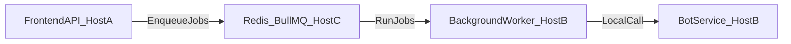
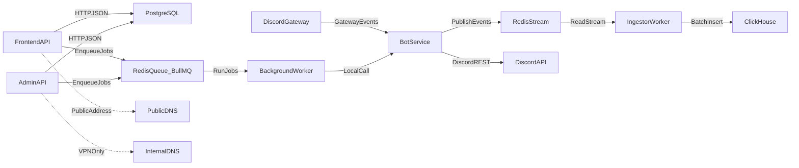

# 2.3. Потоки данных (Data Flow)

> **Важное примечание:** Перед началом реализации необходимо изучить всю документацию в папке `ABOUT/` и её подпапках (`API_SPEC_ADMIN`, `API_SPEC_FRONT`), а также ознакомиться с уже описанными пунктами в папке `spec/` для полного понимания контекста и текущих архитектурных решений.

## Поток событий (Event Pipeline)

Цель — доставить сырые события из Discord в аналитическое хранилище с минимальной потерей данных и возможностью батчинга.

1. **Discord Gateway** отправляет события в **Bot Service**.
2. **Bot Service** публикует события в **Redis Stream**.
3. **Ingestor Worker** читает Stream, выполняет минимальную трансформацию/анонимизацию.
4. **Ingestor Worker** пишет данные пакетами в **ClickHouse**.

## Поток команд и изменений (Command Flow)

Цель — обработать пользовательские и админские команды и синхронизировать состояние с Discord и БД.

1. **Frontend API** (публичный) принимает запросы от клиентского интерфейса.
2. **Admin API** (внутренний) принимает админ‑запросы через VPN.
3. API‑сервисы читают/пишут в **PostgreSQL**, при необходимости ставят задачи в **Redis** (BullMQ).
4. **Background Worker** выполняет задачи и инициирует вызовы **Bot Service**.
5. **Bot Service** обращается к **Discord REST API** для выполнения команд (например, обновление названия канала).

## Inter-service RPC

Frontend API и Bot Service размещаются на разных хостах/сетях, поэтому прямой обмен по HTTP между ними невозможен и не используется.

- **Frontend API не выполняет** прямых HTTP-вызовов к Bot Service.
- Весь обмен командами идёт **исключительно через Redis (BullMQ)**: API ставит задачи в очереди, воркеры (на том же хосте, что и Bot Service) забирают задачи и выполняют их, при необходимости взаимодействуя с Bot Service локально.
- **Синхронные ответы** (например, «проверить токен бота»): использовать паттерн **Request-Response над Redis** с временными очередями ответов — отдельная очередь или канал ответа на запрос с correlation id и TTL.

## Разделение адресов API

- **Frontend API Service** размещается по публичному адресу (например, `api.server.ninja`).
- **Admin API Service** размещается по внутреннему адресу и доступен только через VPN (например, `admin-api.internal.server.ninja`).
- Базовые URL сервисов задаются через переменные окружения, чтобы фронтенд и админка указывали на разные адреса.

## Схема потоков (mermaid)

